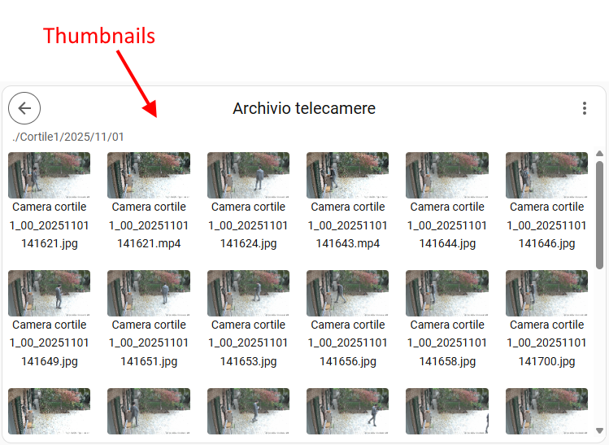

# Media Explorer Card
[![GitHub Release][releases-shield]][releases] [![License][license-shield]](LICENSE) [![hacs][hacs-shield]][hacs]

![Project Maintenance][maintenance-shield]

A **Lovelace custom card** for Home Assistant that allows browsing media resources, similar to the built-in "Media" dashboard.  
Supports **image viewing** and **video playback** with a simple user interface.

---

## Screenshot


## Features
* Browse media folders and files directly from your dashboard.
* Option to load thumbnails for images and videos.
* Display images and play videos inline or in fullscreen mode.
* Smart navigation system, with optional caching for instant loading.

## Usage

Example:
```yaml
type: custom:media-explorer-card
startPath: media-source://media_source/home_nas_antifurto/telecamere
title: Archivio telecamere
showMenuButton: true
showNavigationInfo: true
enableCache: true
enablePreview: true
savePreview: true
grid_options:
  columns: 20
  rows: 7
```

| Option             | Type   | Description                                       | Optional | default value |
| ------------------ | ------ | ---------------------------------------------     | -------- | ------------- |
| startPath          | string | Start directory                                   | false    |               |
| title              | string | Title of the card                                 | true     | null          |
| showMenuButton     | bool   | Shows the 3-dot icon in the top-right corner      | true     | true          |
| showNavigationInfo | bool   | Shows the path & file name in the header          | true     | true          |
| enableCache        | bool   | Enable the caching system (see description below) | true     | true          |
| enablePreview      | bool   | Enable the thumbnail load of images and videos    | true     | true          |
| savePreview        | bool   | Saves the thumbnail in the volatile memory        | true     | true          |
| itemSize           | string | Size of the folders/files icons or previews       | true     | "200px"       |

Use grid_options to size the card in your dashboard.

### Cache
If enableCache option is enabled, it records a navigation map in the non-volatile memory of the browser. This provides the fastest navigation experience for those folders you have already visited. To erase the saved navigation map you can use the menu button:


### Thumbnails
With enablePreview option enabled, the card loads thumbnails for images and videos files. 
With savePreview option enabled, thumbnails are saved in the volatile memory of the browser. This means that thumbnails already loaded will be instantly available and data will be completely erased with the next webpage reload. Thumbnails are never saved in the non-volatile memory.



## HACS Installation Instructions (recommended)

- On your Home Assistant sidebar menu, go to HACS > Frontend
- Click on the 3-dot overflow menu in the upper right, and select `custom repositories` item.
- Copy / paste `https://github.com/pennisiandrea/media-explorer-card.git` in the Repository textbox and select `Dashboard` for the category entry.
- Click on `Add` to add the custom repository.
- You can then click on the `Media Explorer Card` repository entry (you may need to filter your list first to find the new entry).
- Click on `download` to start the download. It will install the card to your `/config/www/community/media_explorer_card` directory.
- Go back on your dashboard and click on the icon at the right top corner then on Edit dashboard.
- You can now click on Add card in the bottom right corner and search for "custom:media-explorer-card".

## Manual Installation

- using the tool of choice open the directory (folder) for your HA configuration (where you find `configuration.yaml`).
- change directory to the `www` folder; if you don't have this directory, then create it.
- download the `media-explorer-card.js` file from the [GitHub repository](https://github.com/pennisiandrea/media-explorer-card.git) into your `<config>/www` folder.
- on your dashboard click on the icon at the right top corner then on Edit dashboard.
- click again on that icon and then on Manage resources.
- click on Add resource.
- copy and paste this: `/local/media-explorer-card.js`.
- click on `JavaScript Module` then Create.
- go back and refresh your page.
- you can now click on Add card in the bottom right corner and search for "custom:media-explorer-card".
- after any update of the file you will have to edit `/local/media-explorer-card.js`.

***

[releases-shield]: https://img.shields.io/github/release/pennisiandrea/media-explorer-card.svg?style=for-the-badge
[releases]: https://github.com/pennisiandrea/media-explorer-card/releases
[license-shield]: https://img.shields.io/github/license/pennisiandrea/media-explorer-card.svg?style=for-the-badge
[hacs]: https://github.com/hacs/integration
[hacs-shield]: https://img.shields.io/badge/HACS-Default-41BDF5.svg?style=for-the-badge
[maintenance-shield]: https://img.shields.io/badge/maintainer-Andrea%20Pennisi%20%40pennisiandrea-blue.svg?style=for-the-badge