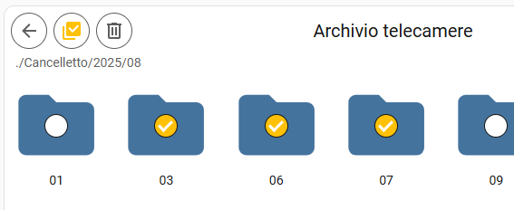

# Media Explorer Card
[![GitHub Release][releases-shield]][releases] [![License][license-shield]](LICENSE) [![hacs][hacs-shield]][hacs]

![Project Maintenance][maintenance-shield]

A lightweight and intuitive Lovelace custom card for **Home Assistant** that enables easy navigation of local and remote media resources.
Browse folders, preview images, and play videos **directly within your dashboard** — without leaving the page.

---
## Features
* Browse media folders and files directly from your dashboard.
* Option to load thumbnails for images and videos.
* Image preview and video playback in-card or fullscreen mode
* Smart navigation system, with optional caching for instant loading.
* Delete files and folders.

## Screenshots


## Usage
Minimal implementation:
```yaml
type: custom:media-explorer-card
startPath: media-source://media_source/home_nas_antifurto/telecamere
```

Full-options implementation:
```yaml
type: custom:media-explorer-card
startPath: media-source://media_source/home_nas_antifurto/telecamere
title: Archivio telecamere
showMenuButton: true
showDeleteButton: false
showNavigationInfo: true
enableCache: true
enablePreview: true
savePreview: true
itemSize: 200px
masonryMaxHeight: 100%
grid_options:
  columns: 20
  rows: 7
```

| Option             | Type   | Description                                                | Optional | default value |
| ------------------ | ------ | ---------------------------------------------------------  | -------- | ------------- |
| startPath          | string | Start directory                                            | false    |               |
| title              | string | Title of the card                                          | true     | null          |
| showMenuButton     | bool   | Shows the 3-dot icon in the top-right corner               | true     | true          |
| showDeleteButton   | bool   | Shows the select & delete button (read description below!) | true     | false         |
| showNavigationInfo | bool   | Shows the path & file name in the header                   | true     | true          |
| enableCache        | bool   | Enable the caching system (see description below)          | true     | true          |
| enablePreview      | bool   | Enable the thumbnail load of images and videos             | true     | true          |
| savePreview        | bool   | Saves the thumbnail in the volatile memory                 | true     | true          |
| itemSize           | string | Size of the folders/files icons or previews                | true     | "200px"       |
| masonryMaxHeight   | string | Max height of the card - useful on masonry view            | true     | "100%"        |

Use grid_options to size the card in your dashboard.

### Cache
If enableCache option is enabled, it records a navigation map in the non-volatile memory of the browser. This provides the fastest navigation experience for those folders you have already visited. To erase the saved navigation map you can use the menu button:


### Thumbnails
With enablePreview option enabled, the card loads thumbnails for images and videos files. 
With savePreview option enabled, thumbnails are saved in the volatile memory of the browser. This means that thumbnails already loaded will be instantly available and data will be completely erased with the next webpage reload. Thumbnails are never saved in the non-volatile memory.


### Delete feature
**This feature works only if you have installed the custom integration https://github.com/chomupashchuk/delete-file-home-assistant**

With showDeleteButton option enabled, two new buttons become visible.
The first one activates the selection mode, allowing the user to select one or more items in the browser. The other deletes all selected items.
  
Be careful, deleted items cannot be recovered.


## HACS Installation Instructions (recommended)
Use this link to directly go to the repository in HACS

[](https://my.home-assistant.io/redirect/hacs_repository/?owner=pennisiandrea&repository=media-explorer-card&category=frontend)

or

1. Install HACS if you don't have it already
2. Open HACS in Home Assistant
3. Search for "Media Explorer Card"
4. Click the download button. 

## Manual Installation

1. Download media-explorer-card.js file from the latest release.
2. Put media-explorer-card.js file into your config/www folder.
3. Add reference to media-explorer-card.js in Dashboard:
    Settings → Dashboards → More Options icon → Resources → Add Resource → Set Url as /local/media-explorer-card.js → Set Resource type as JavaScript Module. Note: If you do not see the Resources menu, you will need to enable Advanced Mode in your User Profile

***

[releases-shield]: https://img.shields.io/github/release/pennisiandrea/media-explorer-card.svg?style=for-the-badge
[releases]: https://github.com/pennisiandrea/media-explorer-card/releases
[license-shield]: https://img.shields.io/github/license/pennisiandrea/media-explorer-card.svg?style=for-the-badge
[hacs]: https://github.com/hacs/integration
[hacs-shield]: https://img.shields.io/badge/HACS-Default-41BDF5.svg?style=for-the-badge
[maintenance-shield]: https://img.shields.io/badge/maintainer-Andrea%20Pennisi%20%40pennisiandrea-blue.svg?style=for-the-badge