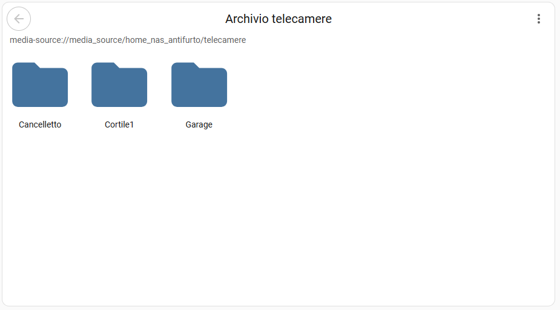
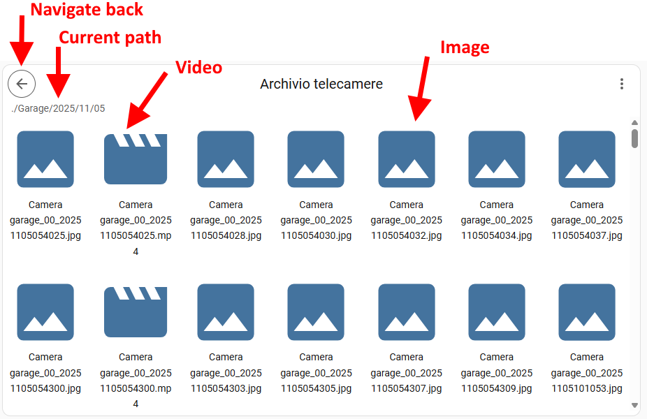
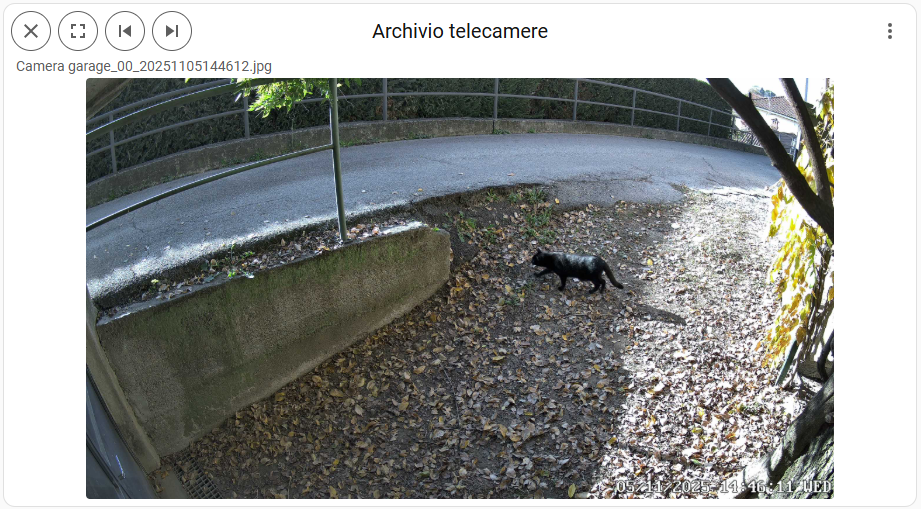
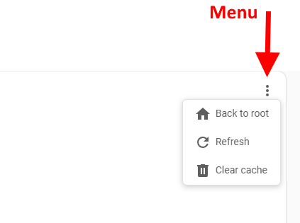

# Media Explorer Card

A **Lovelace custom card** for Home Assistant that allows browsing media resources, similar to the built-in "Media" dashboard.  
Supports **image viewing** and **video playback** with a simple user interface.

*Even though the functionality of this card is almost complete, a complete debug and error handling has not yet been done. For this reason, this card should be considered a BETA version. Please report issues.* 

---

## Screenshot





## Usage

```yaml
type: custom:media-explorer-card
startPath: media-source://media_source/home_nas_antifurto/telecamere
title: Archivio telecamere
showMenuButton: true
showNavigationInfo: true
enableCache: true
grid_options:
  rows: 7
  columns: 20
```

| Option             | Type   | Description                                       | Optional | default value |
| ------------------ | ------ | ---------------------------------------------     | -------- | ------------- |
| startPath          | string | Start directory                                   | false    |               |
| title              | string | Title of the card                                 | true     |               |
| showMenuButton     | bool   | Shows the 3-dot icon in the top-right corner      | true     | true          |
| showNavigationInfo | bool   | Shows the path & file name in the header          | true     | true          |
| enableCache        | bool   | Enable the caching system (see description below) | true     | true          |

Use grid_options to properly size the card in your dashboard.

This card implements resource caching in the browser in order to provide a fast navigation experience. It saves the entire navigation map in the background. By clicking the 3-dot icon in the top-right corner you can clear that memory, which might be useful in certain situations.


## HACS Installation Instructions (recommended)

- On your Home Assistant sidebar menu, go to HACS > Frontend
- Click on the 3-dot overflow menu in the upper right, and select `custom repositories` item.
- Copy / paste `https://github.com/pennisiandrea/media-explorer-card.git` in the Repository textbox and select `Dashboard` for the category entry.
- Click on `Add` to add the custom repository.
- You can then click on the `Media Explorer Card` repository entry (you may need to filter your list first to find the new entry).
- Click on `download` to start the download. It will install the card to your `/config/www/community/media_explorer_card` directory.
- Go back on your dashboard and click on the icon at the right top corner then on Edit dashboard.
- You can now click on Add card in the bottom right corner and search for "custom:media-explorer-card".

## Manual Installation

- using the tool of choice open the directory (folder) for your HA configuration (where you find `configuration.yaml`).
- change directory to the `www` folder; if you don't have this directory, then create it.
- download the `media-explorer-card.js` file from the [GitHub repository](https://github.com/pennisiandrea/media-explorer-card.git) into your `<config>/www` folder.
- on your dashboard click on the icon at the right top corner then on Edit dashboard.
- click again on that icon and then on Manage resources.
- click on Add resource.
- copy and paste this: `/local/media-explorer-card.js`.
- click on `JavaScript Module` then Create.
- go back and refresh your page.
- you can now click on Add card in the bottom right corner and search for "custom:media-explorer-card".
- after any update of the file you will have to edit `/local/media-explorer-card.js`.

***

[releases-shield]: https://img.shields.io/github/release/pennisiandrea/media-explorer-card.svg?style=for-the-badge
[releases]: https://github.com/pennisiandrea/media-explorer-card/releases
[license-shield]: https://img.shields.io/github/license/pennisiandrea/media-explorer-card.svg?style=for-the-badge
[hacs]: https://github.com/hacs/integration
[hacs-shield]: https://img.shields.io/badge/HACS-Default-41BDF5.svg?style=for-the-badge
[maintenance-shield]: https://img.shields.io/badge/maintainer-Andrea%20Pennisi%20%40pennisiandrea-blue.svg?style=for-the-badge